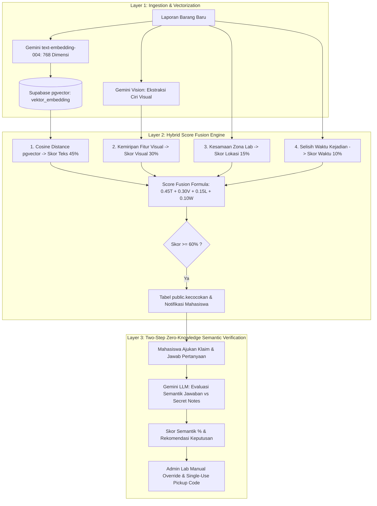

# REFOUND - Lost & Found Digital Komunitas Gedung Lab

[](https://nextjs.org/)
[](https://react.dev/)
[](https://aistudio.google.com/)
[](https://supabase.com/)
[](https://tailwindcss.com/)
[](https://vercel.com/)

**REFOUND** adalah sistem *Lost & Found* tertutup berbasis **AI Vector Matching & Semantic Verification** untuk komunitas dua program studi (Teknik Informatika & Sistem Informasi) yang berada dalam satu gedung laboratorium di **Universitas Trunojoyo Madura**.

Dikembangkan khusus untuk kompetisi **Trunodjoyo Creative Competition (TCC Vibe Code 2026)**.

---

## 🤖 Konsep & Arsitektur AI Matching

REFOUND mengintegrasikan **Google AI Studio (Gemini API - Free Tier)** dan **Supabase pgvector** dalam arsitektur 3-Layer Pipeline:



---

### 🔍 3 Titik Penggunaan AI Utama

#### 1. AI Vector Similarity & Score Fusion (Pencocokan Kandidat)
Menghitung probabilitas kecocokan antara laporan kehilangan vs penemuan dengan formula matematis transparan:

$$\text{MatchScore} = 0.45 \times \text{Teks} + 0.30 \times \text{Visual} + 0.15 \times \text{Lokasi} + 0.10 \times \text{Waktu}$$

- **Skor Teks ($45\%$)**: Kemiripan semantik deskripsi barang via `text-embedding-004` (768 dimensi) dihitung dengan Cosine Distance.
- **Skor Visual ($30\%$)**: Ekstraksi & perbandingan atribut visual foto (warna, merek, bentuk, goresan fisik).
- **Skor Lokasi ($15\%$)**: Kesamaan zona gedung lab (sama: $1.0$, berbeda: $0.5$).
- **Skor Waktu ($10\%$)**: Kedekatan waktu penemuan & kehilangan $\max\left(0, 1 - \frac{\text{selisihJam}}{72}\right)$.

#### 2. LLM Semantic Verification Engine (Zero-Leakage Claim)
- Membandingkan makna semantik antara jawaban klaim mahasiswa dengan catatan rahasia (*secret notes*) yang disimpan Admin Lab.
- Menghasilkan skor verifikasi semantik ($0 - 100\%$) dan alasan evaluasi **tanpa pernah membocorkan ciri rahasia ke antarmuka publik**.

#### 3. LLM Admin Verification Question Suggester (Asisten Admin Lab)
- Merekomendasikan 2–3 pertanyaan verifikasi kepemilikan spesifik per kategori barang saat Admin Lab mendaftarkan barang temuan fisik (*physical custody*).

---

### 🎁 Mengapa Menggunakan Google AI Studio (Gemini)?

| Fitur | Google AI Studio (Gemini) | Provider Lain (OpenAI) |
| :--- | :--- | :--- |
| **Biaya / Free Tier** | **100% Gratis Tanpa Deposit Kartu Kredit** | Memerlukan deposit saldo berbayar |
| **Model Embedding** | `text-embedding-004` (768 dimensi, cepat & akurat) | `text-embedding-3-small` (1536 dimensi) |
| **Model Reasoning** | `gemini-2.5-flash` / `gemini-1.5-flash` | `gpt-4o-mini` |
| **Multimodal** | Native support Teks + Gambar | Terpisah / Biaya tambahan |
| **Rate Limit Gratis** | Hingga **15 RPM / 1 Juta TPM** (Sangat cukup untuk demo & hackathon) | 3 RPM (Free) / Berbayar |

---

## 🛡️ Mekanisme Fail-Safe Adapter Pattern & Manual Override

REFOUND menerapkan **AI Adapter Pattern** dengan ketahanan tingkat tinggi (*graceful degradation*) agar sistem **100% selalu berfungsi dan aman didemokan** dalam kondisi apa pun:

### 1. Automatic Callback Fallback Engine
- Jika API Key (Gemini/OpenAI) tidak diisi, mengalami timeout jaringan, atau kehabisan kuota:
  - Sistem secara otomatis (*automatic callback*) beralih ke **Local Fallback Engine** berbasis *Deterministic Keyword Overlap & Local String Matching*.
  - Aplikasi **tidak akan pernah crash** atau menampilkan *error 500* kepada pengguna maupun juri.

### 2. Admin Manual Override (*Admin as Trust*)
- Rekomendasi skor AI **bukan keputusan final**.
- Admin Lab memiliki wewenang penuh (*manual override*) untuk menyetujui atau menolak pengajuan klaim mahasiswa berdasarkan bukti fisik di lapangan.

---

## 🎨 Palet Warna & Panduan Desain

Mengikuti panduan desain resmi [AGENTS.md](file:///e:/Hackhaton/TCC2026/refound-app/AGENTS.md):

- 🔵 **Primary (Navy)** - `#0B1633` → Heading, navigasi, teks penting
- 🟢 **Accent (Teal)** - `#12A99A` → Tombol CTA, active state
- 🟠 **Attention (Coral)** - `#FF765F` → Warning, reject, destructive
- ⚪ **Surface (Off-white)** - `#F5F7FA` → Background halaman

**Warna Status (Badge)**:
- Gray `#9CA3AF` → Diajukan / Kedaluwarsa
- Amber `#F59E0B` → Menunggu Validasi / Penyerahan
- Blue `#3B82F6` → Aktif / Sedang Dianalisis
- Indigo `#6366F1` → Potensi Cocok / Klaim Ditinjau
- Green `#10B981` → Disimpan Admin / Disetujui / Dikembalikan
- Red `#EF4444` → Ditolak

---

## 🔑 Cara Mendapatkan API Key Google Gemini Gratis

1. Kunjungi [Google AI Studio API Keys](https://aistudio.google.com/app/apikey).
2. Login dengan akun Google Anda.
3. Klik **"Create API Key"** (pilih project baru atau project Google Cloud yang ada).
4. Salin API Key tersebut dan masukkan ke dalam file `.env.local` atau pengaturan Environment Variables di Vercel:
   ```bash
   GEMINI_API_KEY=AIzaSy...
   AI_PROVIDER=gemini
   ```

---

## 🚀 Panduan Setup & Pengembangan Lokal

### 1. Prasyarat
- Node.js versi 18+ atau 20+
- Akun Supabase (untuk database PostgreSQL + pgvector)
- API Key Google AI Studio (Opsional, ada mode fallback offline/mock)

### 2. Langkah Instalasi

```bash
# 1. Clone repositori
git clone https://github.com/ZekkCode/REFOUND.git
cd REFOUND/refound-app

# 2. Install dependensi
npm install

# 3. Salin environment variables
cp .env.example .env.local

# 4. Jalankan server pengembangan
npm run dev
```

Buka [http://localhost:3000](http://localhost:3000) di browser Anda.

---

## 🗄️ Setup Database Supabase & pgvector

1. Buka [Supabase Dashboard](https://database.new) dan buat project baru.
2. Buka tab **SQL Editor**.
3. Jalankan skrip [supabase/schema.sql](file:///e:/Hackhaton/TCC2026/refound-app/supabase/schema.sql) untuk membuat:
   - Ekstensi `vector` (pgvector 768 dimensi untuk Gemini).
   - Tipe enum (`tipe_laporan`, `status_laporan`, `status_klaim`, `tipe_notifikasi`).
   - Tabel master zona, laporan, foto, rahasia temuan, vektor embedding, kecocokan, klaim, notifikasi, dan riwayat status.
   - Aturan Row Level Security (RLS) dan Trigger Profil Mahasiswa/Admin.
   - Fungsi RPC `cari_laporan_mirip_vektor()`.

---

## 🧪 Pengujian Otomatis (Blackbox Integration Suite)

REFOUND dilengkapi dengan automated blackbox test suite untuk menguji integrasi API backend secara end-to-end:

```bash
# Jalankan server Next.js di terminal 1:
npm run dev

# Jalankan blackbox testing di terminal 2:
node tests/blackbox.test.js
```

**Skenario yang Diuji (10 Test Cases)**:
1. `TC-01/02`: Katalog barang temuan publik & pencarian kata kunci.
2. `TC-03/04`: Validasi pembuatan laporan & proteksi data rahasia.
3. `TC-05`: Kalkulasi skor kecocokan AI (Range $0.0 - 1.0$).
4. `TC-06`: Pengajuan klaim & evaluasi semantik AI.
5. `TC-07`: Persetujuan Admin Lab & pembuatan kode pengambilan (*single-use OTP*).
6. `TC-08`: Serah terima fisik barang & penutupan kasus.
7. `TC-09`: Pengambilan notifikasi realtime akun mahasiswa.
8. `TC-10`: Profil dan autentikasi pengguna.

---

## ☁️ Panduan Auto-Deploy di Vercel & CI/CD

Aplikasi ini telah dikonfigurasi untuk **Auto-Deploy di Vercel** setiap kali ada commit baru di branch `main` repositori GitHub [ZekkCode/REFOUND](https://github.com/ZekkCode/REFOUND).

### Environment Variables di Vercel:
- `NEXT_PUBLIC_SUPABASE_URL`
- `NEXT_PUBLIC_SUPABASE_ANON_KEY`
- `SUPABASE_SERVICE_ROLE_KEY`
- `AI_PROVIDER` (Set `gemini` untuk live API atau `mock` untuk fallback offline)
- `GEMINI_API_KEY` (Kunci gratis dari Google AI Studio)
- `NEXT_PUBLIC_APP_URL` (`https://refound-app.vercel.app`)

---

## 🛠️ Struktur Direktori

```text
refound-app/
├── .github/
│   └── workflows/ci.yml    # GitHub Actions Automated Build & Lint Check
├── public/                 # Aset statis & logo
├── src/
│   ├── app/                # App Router Next.js (Rute Bahasa Indonesia)
│   │   ├── admin/          # Portal Admin Lab (Penitipan, Klaim, Penyerahan)
│   │   ├── api/            # Route Handlers API (Laporan, Match, Klaim, Admin)
│   │   ├── barang-temuan/  # Katalog Publik Barang Temuan
│   │   ├── dashboard/      # Dashboard Mahasiswa
│   │   ├── kecocokan/      # AI Match Candidate Ranking & Side-by-Side
│   │   ├── klaim/          # Form Pengajuan Klaim Mahasiswa
│   │   ├── lapor/          # Form Lapor Kehilangan & Penemuan
│   │   ├── globals.css     # Styling Design System & Tailwind CSS v4
│   │   └── page.tsx        # Beranda / Landing Page Utama
│   ├── komponen/           # Komponen UI Modular Bahasa Indonesia
│   └── pustaka/            # Modul AI Adapter, Supabase, & Alur Kerja
│       ├── ai/
│       │   ├── gemini.ts              # Klien REST Google AI Studio (Gemini)
│       │   ├── embedding.ts           # Vector Embedding & Cosine Similarity
│       │   ├── verifikasi-semantik.ts # Evaluasi Semantik Klaim & Question Suggester
│       │   └── pencocokan.ts          # Score Fusion & Fail-Safe Adapter Pattern
│       ├── alur-kerja/                # Tipe Data & Katalog Zona Laboratorium
│       └── supabase/                  # Supabase Client, Auth, & RBAC Helper
├── supabase/
│   └── schema.sql          # Migrasi Schema Supabase PostgreSQL + pgvector
├── tests/
│   └── blackbox.test.js    # Suite Pengujian Blackbox Automated Testing
├── .env.example            # Blueprint Variabel Lingkungan
├── .gitignore              # Konfigurasi Ignore File Sensitif & Build
├── vercel.json             # Konfigurasi Auto-Deploy Vercel
└── README.md               # Dokumentasi Lengkap Proyek
```

---

## 📄 Lisensi & Kredit

Dikembangkan oleh **Tim REFOUND** untuk kompetisi **TCC Vibe Code 2026** di **Universitas Trunojoyo Madura**.
